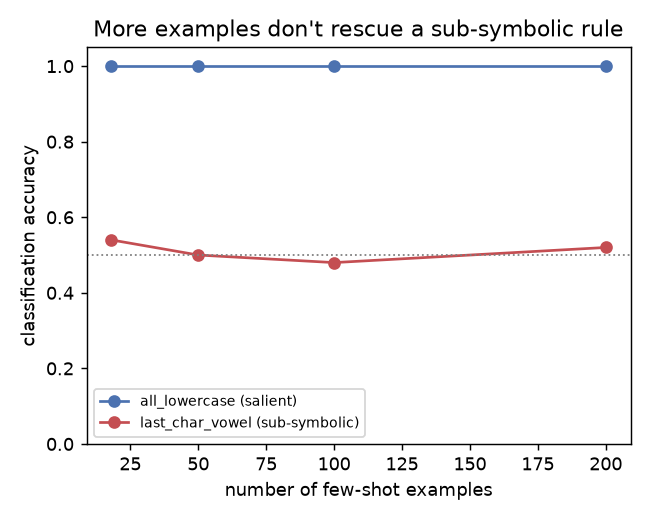
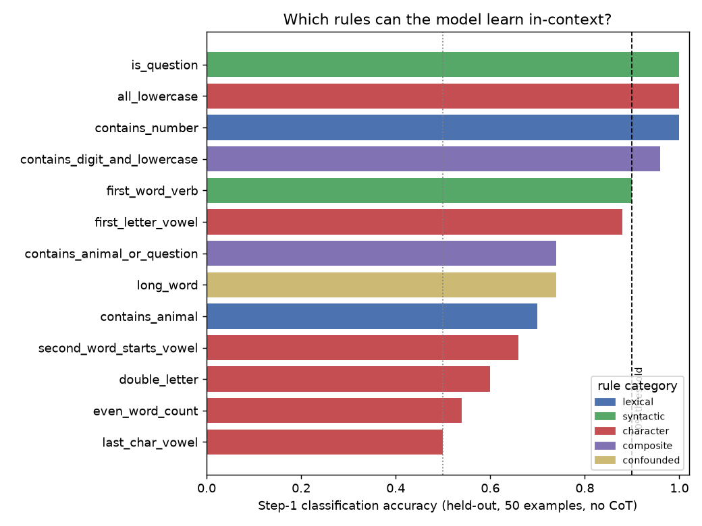
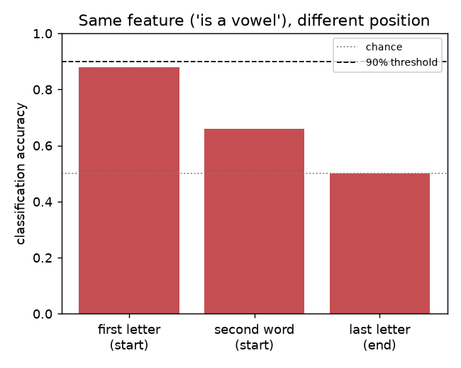
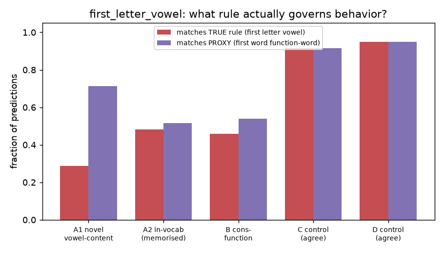
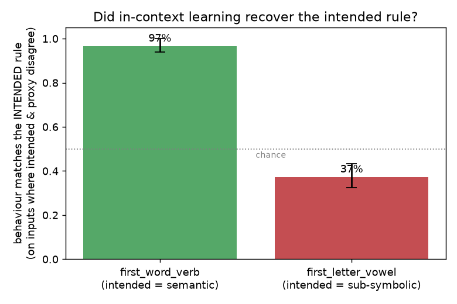

# Results notebook — can an LLM articulate the rules it learns in-context?

This is a **lab notebook**: a slow, plain-language walkthrough of every experiment
we ran, in the order we ran them — what we were thinking, what we found, and why
each result made us change the next step. It assumes no background. The formal
report is written separately; this is the working record behind it.

Subject model throughout: **Claude Opus 4.8**.

---

## 0. The question, in plain English

A large language model (LLM) reads text and produces text. A handy trick: if you
paste a few **labeled examples** into the prompt and then a new item, it will often
continue the pattern. Like a worksheet:

```
Input: "the cat sat on the mat"   Label: True
Input: "THE DOG RAN"              Label: False
Input: "the house is cold"        Label: True
Input: "BIG LOUD NOISE"           Label: ?
```

A person infers the hidden rule ("True = all lowercase") and labels the last one
`False`. LLMs do this too. Learning the pattern purely from examples in the prompt
— with no retraining — is called **in-context learning**.

The research question (from Owain Evans' brief) is a two-part test of the *same*
model:

1. **Can it _use_ a rule?** Given labeled examples, does it label new items correctly?
2. **Can it _state_ that rule in words?**

And specifically: **are there rules the model can reliably _use_ but cannot
_describe_?** We call that the "money quadrant": classify ✓ / articulate ✗. If it
exists, it means a model can be governed by a rule it can't put into words — which
matters for trust, because then its explanations of its own behaviour can't be
taken at face value.

---

## 1. How the experiment is built

For each rule we wrote two tiny pieces of code:

- a **generator** that invents nonsense sentences (e.g. `"kitten loud bright house"`),
- a **labeler** that stamps each sentence True/False *by the real rule*.

Because we wrote the labeler, we always know the correct answer, and the sentences
are freshly invented so the model can't have memorised them. We force every batch
to be **half True / half False** so the model can't win by always guessing one
answer.

We ask the model two things:

- **Step 1 — "use it":** show ~50 labeled examples + one new sentence, demand a
  **one-word answer (True/False), no explaining.** We forbid reasoning here on
  purpose — we want a clean measure of whether it can *do the task*.
- **Step 2 — "state it":** show the examples and ask it to write the rule. We try
  this both **with** reasoning allowed (CoT, "chain-of-thought") and **without**.

A key guard: the Step-1 instruction is deliberately vague and never hints at the
rule, so Step 2 isn't accidentally handed the answer.

---

## 2. The experiments, in order

### Experiment 1 — build the harness, test one easy rule (`contains_number`)

**Thinking:** get one rule working end-to-end before doing anything clever.

**Result:** classification **100%** (40/40). Articulation: perfect ("contains a
digit"). A control where we **scramble the few-shot labels** (to check it's really
learning from the examples, not guessing) dropped accuracy from 100% to **70%** —
it fell, but not all the way to a coin-flip, because "contains a number" is such an
obvious property that the model half-relies on its own expectations.

**Why we moved on:** this is the *boring* corner — classify ✓ **and** articulate ✓.
It tells us nothing about the real question. We needed a harder kind of rule.

### Experiment 2 — a "sub-symbolic" rule (`last_char_vowel`)

**Thinking:** the interesting rules might be ones that hinge on *letters and
positions* rather than *meaning* — the kind of thing tokenisation smears (the same
reason LLMs miscount the r's in "strawberry"). "The last letter is a vowel" is our
first probe.

**Result:** classification **55%** — basically a **coin flip**. And when asked to
describe the rule, it flailed: it guessed word-count parity, then first words, then
colours, and never found "last letter is a vowel."

**Why we changed:** a worry — maybe 18 examples is just too few? We needed to know
whether *more examples* would rescue it.

### Experiment 3 — does scale rescue it? (few-shot scaling)

**Thinking:** give the model 18, 50, 100, 200 examples and see if `last_char_vowel`
climbs. Run `all_lowercase` alongside as a contrast.



**Result:** `last_char_vowel` stays **flat at chance** all the way to 200 examples.
`all_lowercase` is **100%** everywhere.

**Conclusion that shaped everything after:** scale is *not* the lever. The model
genuinely cannot *learn* "last letter is a vowel" in-context. And note both are
"character" rules, yet one is trivial and one is impossible — so the **category
label doesn't predict learnability; the _kind of feature_ does** (salient/whole-
string vs. single-position-letter).

### Experiment 4 — map all the rules (Step-1 sweep, 9 rules)

**Thinking:** before testing articulation, find out *which* rules the model can even
do well. Only rules it can classify >90% are eligible for the articulation test.



**Result (a sharp dividing line):** everything that is *salient/holistic/semantic*
(a digit anywhere 100%, all-lowercase 100%, a trailing "?" 100%) is learned;
everything that requires *counting* (even number of words 54%) or *isolating a
position-specific letter* (last letter 50%) sits at chance. One positional rule
survived: `first_word_verb` at 90% — because the *start* of a sentence is a salient
position.

### Experiment 5 — can it articulate the rules it learned? (Step 2)

**Thinking:** take the rules that cleared 90% and ask the model to state them,
**no-CoT** (single-shot) and **with CoT**.

**Result:** all four — `contains_number`, `all_lowercase`, `is_question`,
`first_word_verb` — were articulated **correctly, even no-CoT**. `first_word_verb`
("the first word is a verb") was stated correctly cold.

**Conclusion:** for this library, **learnable ⟺ articulable**. The money quadrant
was *empty*: every rule the model could use, it could also name. We had a clean
"negative" — and a refined thesis: the model doesn't hide rules it uses; for simple
rules it either has access to the feature (use **and** name it) or doesn't (do
neither).

### Experiment 6 — deliberately hunt the money quadrant (4 new rules)

**Thinking:** if learnability needs a salient/holistic feature and articulability
needs a *nameable* feature, the gap should live where a rule is **learnable yet not
cleanly nameable**. We added four rules across two mechanisms:

- **Boolean collapse:** `contains_digit_and_lowercase` (AND), `contains_animal_or_question` (OR)
  — individually-easy features whose *combination* the model might name incompletely.
- **Salient position, sub-symbolic feature:** `first_letter_vowel`,
  `second_word_starts_vowel` — does a salient *position* rescue a *letter-level*
  feature that "last letter" couldn't?

### Experiment 7 — Step-1 sweep on the new rules



**Result:** the conjunction reached **96%**; `first_letter_vowel` **88%**; the
disjunction 74% (dragged down by weak animal detection); `second_word_starts_vowel`
66%. The headline by-product is a clean **salience gradient** for the *same* feature
("is a vowel"): **first letter 88% › second word 66% › last letter 50% (chance).**
Character access decays sharply as the position gets less salient.

### Experiment 8 — articulate the new survivors

**Result:**
- `contains_digit_and_lowercase` (96%): articulated the **full AND** even no-CoT
  ("contains a digit and is all lowercase"). No collapse — the model handles boolean
  structure fine. **No gap.**
- `first_letter_vowel` (88%): **no-CoT it stated a WRONG rule** — "the first word is
  a function word (in/at/on/of/and/by/is/a)" — a *semantic proxy*. **With CoT** it
  enumerated first words, noticed "elephant/apple/umbrella start with vowels," and
  recovered the true rule. **First sign of a gap.**

### Experiment 9 — is the proxy reliable? (6 seeds)

**Thinking:** one example proves nothing. Re-run no-CoT articulation on
`first_letter_vowel` across six different example sets.

**Result:** **4 of 6** no-CoT articulations gave the wrong function-word proxy; 2 of
6 got it right. Even one *CoT* run clung to the proxy and patched a counterexample
with an epicycle ("…and not 'by'") rather than finding the letter rule. The proxy is
the model's **default**, not a fluke.

### Experiment 10 — does the proxy govern behaviour? (faithfulness, first pass)

**Thinking (this is the crux — "faithfulness"):** the model *says* (no-CoT) "first
word is a function word." Does its *behaviour* follow that proxy, or the true rule?
Test on inputs where the two **disagree**.

**First pass (small, n=20, one seed):** looked like behaviour followed the *true*
rule ~63% → we tentatively called the articulation "unfaithful."

**Why we didn't trust it:** the test was small, one seed, and the "vowel-content"
test words were only `apple/elephant/umbrella/old` — all of which appear in the
training vocabulary, so the model may have **memorised** those specific cases rather
than using the letter rule. We tightened it.

### Experiment 11 — tightened faithfulness test (and it reversed)

**Thinking:** 50 items/cell, 3 seeds, and **broaden** the vowel-content words to
*novel* ones (`orange, igloo, oasis, eagle…`) the model never saw in training.



**Result (the opposite of the first pass):**

| cell | true rule / proxy say | behaviour matches true | behaviour matches proxy |
|---|---|---|---|
| A vowel-content (novel) | True / **False** | 49/150 (33%) | **101/150 (67%)** |
| B consonant function-word | False / **True** | 64/150 (43%) | **86/150 (57%)** |
| C control (both True) | T / T | 55/60 | 55/60 |
| D control (both False) | F / F | 57/60 | 57/60 |

**On inputs where the rules disagree, behaviour follows the PROXY 62% and the true
letter rule only 38% (95% CI 32–43%).** The clean cut is **function words → True,
content words → False, regardless of first letter** — i.e. the model is using the
function-word proxy, not the letter rule. The earlier "63% true" was an artifact of
memorised in-vocabulary words; novel words exposed the truth.

**The reframe (and it is a _better_ result):** the model, trained on examples
labeled by "first letter is a vowel," **never learned that rule.** It learned a
*semantic proxy* — "first word is a function word" — that is nearly equivalent on
our distribution (vowel-initial words there are mostly function words). It then
**both behaves by the proxy and articulates the proxy.** So its articulation is
actually **faithful to its behaviour** — it's the *intended* rule that diverges.

This is the **underdetermination** phenomenon: with finite examples, many rules fit,
so "failing to state the *intended* rule" can be *correct* — the model honestly
reports the (different) rule it actually learned. A naive scoring (compare
articulation to the *intended* rule) would have mislabeled this "classify ✓ /
articulate ✗." The counterfactual is what revealed the truth.

*(Later correction, Exp 18: the "novel" cell here still contained 4 in-vocabulary
words; cleaning that out left the result unchanged — 63% proxy on novel words — and
added a memorisation probe. See Experiment 18.)*

### Experiment 12 — does it even know the concept? (isolation probe)

**Thinking:** maybe the model simply *can't represent* "first letter is a vowel." If
so, the whole thing is just incapacity. Test it directly, outside the classification
framing: *"Does the word 'orange' start with a vowel? Yes/No."*

**Result:** **24/24 = 100%.** It is perfect — including the exact novel words it
called *False* in-context (`orange, igloo, oasis`) and the function words it called
*True* in-context (`by, the, with, for`).

**Conclusion:** the failure is **not** missing knowledge. The model *has* the
"first-letter-vowel" concept perfectly. It simply **does not deploy it during
in-context learning**, where it instead settles on the easier semantic proxy. So:
*knows the rule in isolation, learns a different rule from examples, and faithfully
reports the rule it learned.*

### Experiment 13 — does "coupling" survive scrutiny? (`first_word_verb`)

**Thinking:** Experiment 11 means our earlier "learnable ⟺ articulable" rules are
now *suspect* — maybe they too learned proxies that merely *look* like the simple
articulation. `first_word_verb` articulated "first word is a verb"; does behaviour
key on **position** (first word) or **presence** (a verb anywhere)? We separate them
with inputs where the first word is a non-verb but a verb appears later.

**Result:** behaviour follows the **intended positional rule 97%** (145/150, CI
94–100%) and the presence proxy only **3%**. On first-word-*noun* sentences that
contain a verb later, the model says **False** — it keys on the first word's part of
speech, not on whether a verb appears anywhere. Controls clean (first-verb 54/60
True; noun-with-no-verb 60/60 False).

**Conclusion — the crucial contrast.** `first_word_verb` is **genuine**: the model
learned the *intended* rule, and its articulation ("first word is a verb") is
faithful to both its behaviour and our intent. Set against `first_letter_vowel`, the
two rules dissociate cleanly:



So in-context learning does **not** always learn proxies. It recovers the intended
rule when that rule is built on a feature the model represents **semantically**
(`first_word_verb`: "is this word a verb"), and substitutes a semantic **proxy** when
the intended feature is **sub-symbolic** (`first_letter_vowel`: "first letter"). The
deciding factor is the *representability of the intended feature*, not raw difficulty.

---

## 2b. Phase 2 — hardening the findings (Tasks 1–4)

After Experiment 13, three things needed checking before we could trust the
picture: (a) were the *other* "articulable" rules genuine or proxies? (b) do the
confound controls the brief expects hold? (c) does the proxy phenomenon replicate,
or is it a one-off? Plus a code audit. We ran these as a mix of a background agent
(mechanical confounds + audit) and interactive scripts — **one API job at a time**,
because the API account has a low concurrency limit (running three at once gave a
rate-limit error early on).

### Experiment 14 — proxy-check the other survivors (`is_question`, the conjunction)

**Thinking:** Experiment 11 showed "articulated correctly" ≠ "learned the intended
rule." So re-test the other ≥90% rules with the same counterfactual.

**Result:** both **genuine**. `is_question`: with a `?` placed *mid*-sentence (not
trailing), the model says False 97% — it keys on "ends with ?", not "contains ?".
The conjunction: on digit-but-UPPERCASE and lowercase-but-no-digit inputs it says
False 100% — it truly uses the AND, not a single feature. Controls clean.

**Conclusion:** with `first_word_verb` (Exp 13), **3/3 of the non-trivial survivors
learned the intended rule and articulate it faithfully.** `first_letter_vowel`
remains the lone proxy — exactly where the feature is sub-symbolic.

### Experiment 15 — the confound battery (zero-shot, prior-only articulation, seed CIs)

**Thinking:** the brief expects controls that rule out priors and show robustness.

**Result:**
- **Zero-shot (no examples):** every rule is at chance (42–57%), including all
  survivors. So the high few-shot accuracies are genuine in-context learning, not
  priors. (Sharpest: `contains_number`/`is_question` are 100% few-shot but ≤45%
  zero-shot.)
- **Prior-only articulation:** with zero examples the model just guesses "always
  True"; with *shuffled* labels it confabulates a plausible-but-wrong rule (usually
  word-count parity) — never the real one. Articulation is driven by the in-context
  evidence, not priors.
- **Seed CIs (3 seeds):** the survivor-vs-contrast split is robust — the groups' CIs
  do not overlap. `first_word_verb` is the marginal survivor (one seed dipped to 80%).

### Experiment 16 — hunt for a second sub-symbolic-but-learnable rule

**Thinking:** the proxy finding rested on a single rule. Try more sub-symbolic rules
at salient positions.

**Result:** `hunt_first_letter_ae` ("first letter is a or e") learns to **100%** — a
second learnable sub-symbolic rule. Most other candidates failed Step 1. The
instructive failure: `hunt_first_letter_first_half` ("first letter in a–m") is at
**chance (50%)** despite being the *same* salient position — because a–m is an
*arbitrary* cut with no semantic handle, whereas "a or e" / "a vowel" are nameable
categories. **A salient position is necessary but not sufficient; the feature also
needs a semantic handle.**

### Experiment 17 — is the second rule genuine, or another proxy?

**Thinking:** does `hunt_first_letter_ae` generalise the a/e letter rule, or is it a
proxy like `first_letter_vowel`?

**Result:** a **second proxy**. On novel a/e *content* words (apple, eagle) it says
False (12% True) — it does **not** generalise the letter rule. What it labels True is
only a/e *function* words (a, and, at, an). Its real rule is the narrower
"a/e-initial **and** a function word" — it memorised the common a/e function words.
(The one-line auto-verdict averaged to "MIXED 51%," masking this; the per-cell
numbers reveal it — see Exp 18 on why we now report per-cell.) It hit 100%
in-distribution only because that proxy ≈ the intended rule on the training set.

**Conclusion:** the proxy phenomenon **replicates**. Two independent sub-symbolic
"learnable" rules both turn out to be proxies, not genuine sub-symbolic learning.

### Experiment 18 — code audit, and a correction it forced

**Thinking:** before trusting any of this, audit the harness for correctness — a
wrong cell generator or labeler would silently flip a verdict.

**Result:** a static review (no API calls) found **no critical bug**. It positively
verified that every labeler matches its articulation, every counterfactual cell is
correctly constructed, controls are excluded from the aggregates, there is no
train/test leakage, and cache keys cannot collide. It flagged one real bias issue
(**M1**): the `first_letter_vowel` "novel words" cell still contained 4
in-vocabulary words (`apple, elephant, umbrella, old`), so the code didn't fully
match the Experiment-11 claim.

**The fix — which turned the flaw into a stronger finding:** splitting that cell into
*novel* vs *in-vocab* words and re-running gave a **cleaner 63% proxy** on novel words
alone (Fig. 4, updated), plus a **memorisation probe**: in-vocab vowel words read True
**48%** vs novel ones **29%** — direct evidence that the model memorised specific
training words rather than generalising the rule. The audit also noted that a pooled
one-line verdict can mask an asymmetric proxy (Exp 17), so we now report **per-cell**.

---

## 3. What it all means (current thesis)

Putting it together:

> **In-context few-shot learning recovers the intended rule when that rule is built
> on a feature the model represents _semantically_, but substitutes an
> on-distribution-equivalent _semantic proxy_ when the intended feature is
> _sub-symbolic_ (position-specific letters, counts). In the proxy case the model
> faithfully _uses_ and _reports_ the proxy — so the apparent "articulation failure"
> is _underdetermination_ (it learned a different rule and honestly says so), not
> introspective failure or dishonesty. Only counterfactual / out-of-distribution
> probing distinguishes the two.**

The supporting structure:

- **A learnability boundary:** salient/holistic/semantic features are learned in-
  context; purely sub-symbolic ones (position-specific letters, counts) are not —
  and more examples don't fix it (Fig. 3).
- **A salience gradient:** the *same* letter feature is learnable at a salient
  position and not at an unsalient one — first 88% › second 66% › last 50% (Fig. 2).
- **The proxy phenomenon:** `first_letter_vowel` is the one rule that is sub-symbolic
  *and* learnable (via the salient first position). There the model learns and
  reports a semantic proxy (function-word), even though it knows the true letter
  concept perfectly in isolation (100%).
- **Genuine vs proxy (the control):** when the intended feature *is* semantic, ICL
  recovers it and articulation is faithful — verified for **3/3** non-trivial
  survivors (`first_word_verb` 97%, `is_question`, the conjunction; Exps 13–14). The
  proxy phenomenon appears specifically when the feature is sub-symbolic (Fig. 5).
- **Three distinct rules** are visibly separated for `first_letter_vowel`: *intended*
  = first-letter-vowel; *articulated* (no-CoT) = function-word; *behavioural* =
  mostly the function-word proxy (**63% on novel words**; Fig. 4). Intended ≠
  (articulated ≈ behavioural). A memorisation probe confirms it: in-vocab vowel words
  read True 48% vs novel 29%.
- **It replicates, and needs a semantic handle.** A second sub-symbolic rule,
  `hunt_first_letter_ae`, is also learned as a proxy (a/e *function* words), not the
  intended letter rule (Exps 16–17). And an *arbitrary* sub-symbolic cut with no
  semantic handle (`first_letter_first_half`, a–m) isn't learnable at all (50%) — a
  salient position is necessary but not sufficient.
- **Controls pass (Exp 15, 18).** Zero-shot is at chance for every rule (genuine ICL);
  articulation can't be produced from zero/shuffled examples (no prior leakage);
  Step-1 holds with non-overlapping seed CIs; a code audit found no correctness bug
  that changes a verdict.

A subtlety worth stressing: **CoT articulation can mislead.** With reasoning the
model *derives* "first letter is a vowel," but its no-CoT behaviour doesn't follow
that derivation — so the CoT answer is post-hoc reconstruction, not a readout of the
rule actually in use, and is *less* faithful to behaviour than the no-CoT proxy.

---

## 4. How this maps to Owain's brief

This section walks through what the brief asks for and where we stand on each point —
honestly, including what is **not** done.

### 4.0 The central question, and our answer

Owain asks: *are there classification tasks an LLM can learn very accurately
in-context (>90%) without being able to articulate the rule?*

Our answer, in one breath: **in the naive sense it looks like "yes," but that is the
wrong comparison, and properly measured the answer is "no — and the reason is
interesting."** Comparing the model's articulation to the rule we *used to generate
the labels*, `first_letter_vowel` looks like a hit (classifies 88%, "fails" to state
the rule). But counterfactual probing shows the model never actually *learned* the
intended sub-symbolic rule — it learned a semantic **proxy** that is equivalent on the
training distribution, and it articulates that proxy **faithfully**. So the genuine
"money quadrant" — *learns the intended rule but cannot articulate it* — is, in our
data, **empty**: every rule the model genuinely learns (a semantic feature) it can
also articulate, and the rules it cannot articulate it never actually learned. The
contribution is therefore a *structural* claim, not a raw gap: **learnability and
articulability are coupled through whether the feature is semantically representable,
and apparent articulation failures are underdetermination.** Whether this generalises
beyond first-letter rules is open (§5).

### 4.1 Step 1 — rules learnable in-context (>90%), simple for humans, no CoT

- **Done.** Six rules clear ~90% on held-out, in-distribution inputs with single-token
  **no-CoT** classification: `contains_number`, `all_lowercase`, `is_question` (100%),
  the conjunction (96%), `first_word_verb` (90%), `first_letter_vowel` (88%). Labels
  are programmatic (no contamination), classes balanced 50/50, test sets held out,
  accuracies carry seed CIs (Exp 15). No-CoT is enforced (thinking off, `max_tokens=5`,
  single-token parse).
- **"Many distinct rules" (Owain stresses this):** we have ~17 rules across five
  categories — a healthy spread for the *learnability* map (Fig. 1). But the set that
  is *both* >90% *and* load-bearing for the articulation question is smaller, and the
  crucial sub-symbolic-but-learnable seam has just **two** cases. This is the main
  Step-1 gap (§5).

### 4.2 Step 2 — articulation (MC or free-form; vary CoT)

- **Done, free-form** — the harder mode Owain points to — in both **no-CoT** and
  **CoT** conditions. For genuine rules the model states the rule correctly even
  single-shot; for `first_letter_vowel` it reliably states a proxy (4/6 seeds).
- **Not done: multiple-choice.** Owain suggests MC first, then free-form; we skipped MC
  because free-form already succeeds where the rule is genuine, so there was no
  recognition-vs-generation gap to chase. MC is the clean missing piece *if* we later
  want to quantify that distinction.
- **CoT finding:** varying CoT surfaced a real subtlety — **CoT articulation can
  mislead** (it derives the true rule post-hoc while no-CoT behaviour follows the
  proxy), so the no-CoT articulation is the more faithful readout. We did not run an
  exhaustive instruction/prompt sweep.

### 4.3 Step 3 — faithfulness (Turpin), and the dishonesty angle

Where we spent the most, and our strongest contribution.

- **Faithfulness as defined** (the articulated rule should counterfactually predict
  behaviour): tested on five rules. Three are **faithful and genuine**
  (`first_word_verb` 97%, `is_question` 97%, the conjunction 100%); two are **proxies**
  (`first_letter_vowel`, `hunt_first_letter_ae`) where behaviour follows a function-word
  proxy — but articulation *matches that behaviour*, so it is faithful to what the
  model does.
- **The "three rules" framing** (intended / articulated / behavioural) is realised
  concretely, and the mismatches are the result (Figs 4–5).
- **Dishonesty / inaccessibility:** the isolation probe (Exp 12) shows the model knows
  "first letter is a vowel" perfectly out of context (100%) yet doesn't deploy it
  in-context. Owain frames a knows-but-won't-say case as possible *dishonesty*. Our
  conclusion is the opposite and more interesting: it is **not dishonesty** — the model
  isn't hiding a rule it uses; it genuinely uses the proxy and reports the proxy. The
  knowledge exists but isn't recruited by in-context learning. So the operative factor
  is *which rule gets learned* (semantic representability), not concealment.
- **The confound experiment** Owain/the strategy doc call for (a rule with a built-in
  spurious correlate, decorrelated at test) *is* the `first_letter_vowel` /
  `hunt_first_letter_ae` story: the proxy is the spurious correlate, and the
  counterfactual decorrelates it.

### 4.4 Controls the brief and strategy doc call for

| Control | Status |
|---|---|
| Shuffled-label (is it real ICL?) | ✅ Exp 1, Exp 15 |
| Zero-shot / prior-only classification | ✅ Exp 15 — all rules at chance |
| Prior-only **articulation** ("the control everyone forgets") | ✅ Exp 15 — can't articulate from zero/shuffled examples |
| Balanced classes + per-class accuracy | ✅ by construction; per-class reported |
| Held-out in-distribution test + CIs | ✅ Exp 15 (Wald CIs, 3 seeds) |
| Seed / order variance | ✅ Exp 15 (3 seeds) |
| Counterfactual minimal pairs / articulation-as-classifier | ✅ Exps 11, 13, 14, 17 |
| Isolation probes | ✅ Exp 12 |
| Code-correctness audit | ✅ Exp 18 |
| **LLM-judge grading (validated)** | ❌ not done — graded by eye (fine at this scale; the brief wants quantitative grading for many rules) |

### 4.5 Output requirements — what is on *you* (not me)

- **The written report** (≤5 pages main + appendix, abstract, PDF): yours to write, per
  the honor-code line in the brief. This notebook is the material to write *from*.
- **Figures:** five in `figures/`, captioned here. Do a final pass on axis labels /
  readability (Owain's tips) when you place them.
- **The strategy doc's "hero figure"** (classify-accuracy vs articulation-accuracy
  scatter) we did **not** build — because the story moved past it: a raw scatter would
  mislabel the proxy cases as "low articulation," when the point is they articulate
  *something* faithfully. Our de facto hero figures are Fig. 5 (genuine vs proxy) and
  Fig. 4. If you want the scatter for a landscape view, it's quick to add.
- **GitHub repo link** (the brief requires one): not pushed yet, and the directory
  isn't a git repo locally — a step for you.
- **Hours:** track and report your total against the 18h cap.

---

## 5. Caveats and what's unfinished (honest)

- **Two proxy rules, not many.** The proxy finding now rests on *two* sub-symbolic
  rules (`first_letter_vowel`, `hunt_first_letter_ae`) rather than one — but both are
  *first-letter* rules. A non-letter sub-symbolic proxy would broaden the claim; they
  are rare by the thesis (most sub-symbolic rules fail Step 1 outright).
- **`first_word_verb` is the marginal survivor** — 90% mean, but one seed dipped to
  80% (Exp 15). Its "genuine" verdict (97%) is solid; its >90% Step-1 status is the
  shaky part. Worth a larger test set if we lean on it.
- **Grading is by eye.** Fine at this scale; a validated LLM-judge would let us
  quantify articulation accuracy across many rules.
- **Two known minor issues, left as-is on purpose:** `DIGITS` has a duplicate `"7"`
  (harmless; removing it would perturb the RNG stream and invalidate cached
  digit-rule results); figure numbers are transcribed from the runs (re-run the
  `experiments/` scripts to regenerate). The audit confirmed neither affects a
  conclusion.
